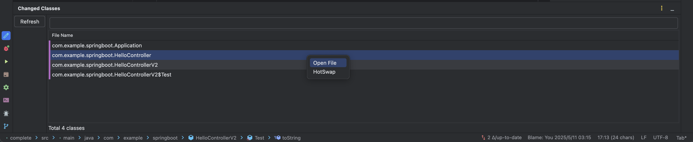

# change-classes-logger

A plugin that helps you manually hot-reload modified class files in IntelliJ IDEA.



[中文文档](README.zh-CN.md)

## Rationale

This plugin enables selective hot-swapping of classes, addressing a common limitation in IntelliJ IDEA's built-in hot-reload mechanism:

### Necessity
IntelliJ IDEA's default hot-reload mechanism automatically reloads all modified classes in the classpath. While this works well in most scenarios, it becomes problematic when incremental compilation fails and incorrectly recompiles unnecessary classes. This plugin provides manual control over which classes to hot-reload, effectively solving this issue.

### Feasibility
When only modifying method implementations, reloading the current class is sufficient. Even when adding or removing class members and methods, we can determine which classes have changed by checking git status, allowing targeted hot-swapping using this tool. This implementation approach is both simple and reliable, meeting the needs of most development scenarios.

## Features

- Automatically detect and display modified class files
- Support manual selection of classes for hot-reloading
- Real-time display of modified file count
- File search filtering support
- User-friendly interface
- Enhanced hot-reloading capabilities when combined with [HotSwapHelper](https://github.com/gejun123456/HotSwapHelper)

## System Requirements

### Build Requirements
- JDK 21 or higher
- Gradle 8.0 or higher

### Target IDE Version
- IntelliJ IDEA 2025.1 or higher
- Supports Java and Kotlin projects

## Installation

### Method 1: Download from Release (Recommended)

1. Visit the [GitHub Releases](https://github.com/biuld/change-classes-logger/releases) page
2. Download the latest version of `changed-classes-logger-*.zip` file
3. Install the plugin in IntelliJ IDEA
   - Open IntelliJ IDEA
   - Go to Settings/Preferences -> Plugins
   - Click the gear icon and select "Install Plugin from Disk..."
   - Select the downloaded zip file
   - Restart the IDE

### Method 2: Build from Source

1. Clone the repository
```bash
git clone https://github.com/biuld/change-classes-logger.git
cd change-classes-logger
```

2. Build the plugin
```bash
./gradlew buildPlugin
```
After building, the plugin file will be located at `build/distributions/change-classes-logger-1.0-SNAPSHOT.zip`

3. Install the plugin in IntelliJ IDEA
   - Open IntelliJ IDEA
   - Go to Settings/Preferences -> Plugins
   - Click the gear icon and select "Install Plugin from Disk..."
   - Select the `change-classes-logger-1.0-SNAPSHOT.zip` file
   - Restart the IDE

## Usage

1. Start a debug session
2. Modify source code files
3. Build the project
   > Recommended to run Gradle's class task: `./gradlew classes`
4. Find the "Changed Classes" tab in the IDE's right toolbar
5. Click the refresh button to update the list of modified files
6. Select the files you want to hot-reload in the right panel
7. Right-click the selected files and choose "HotSwap" to perform hot-reloading

## Development

This project is built using Kotlin and Gradle.

```bash
# Clone the project
git clone https://github.com/biuld/change-classes-logger.git

# Build the plugin
./gradlew buildPlugin

# Run tests
./gradlew test
```

## License

This project is released under the GNU General Public License v3.0. See the [LICENSE](LICENSE) file for details.

This program is free software: you can redistribute it and/or modify it under the terms of the GNU General Public License as published by the Free Software Foundation, either version 3 of the License, or (at your option) any later version.

This program is distributed in the hope that it will be useful, but WITHOUT ANY WARRANTY; without even the implied warranty of MERCHANTABILITY or FITNESS FOR A PARTICULAR PURPOSE. See the GNU General Public License for more details.

You should have received a copy of the GNU General Public License along with this program. If not, see <https://www.gnu.org/licenses/>. 